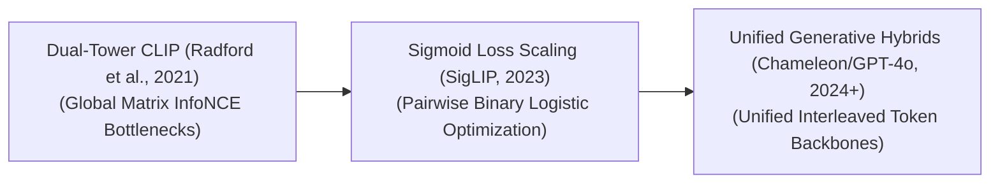

# Awesome-CLIP
## Contrastive Language-Image Pre-training (CLIP): Evolution, Variants, & Applications

Contrastive Language-Image Pre-training (CLIP) is a foundational multimodal deep learning paradigm that unifies computer vision and natural language processing into a shared semantic embedding space. Introduced by OpenAI in 2021 (Radford et al., "Learning Transferable Visual Models From Natural Language Supervision"), CLIP completely changed the vision-language domain by bypassing traditional, closed-vocabulary supervised labeling loops (e.g., categorizing an image into a fixed index of 1,000 ImageNet numbers). By training a dual-tower network over hundreds of millions of uncurated internet image-caption pairs using a symmetric contrastive loss function, CLIP maps visual features and textual concepts into a matched coordinate grid. This architecture natively unlocks **zero-shot image classification**, open-vocabulary visual grounding, and text-to-image semantic matching.

---

## 1. The Chronological Evolution

The technical progression of contrastive multimodal scaling has transitioned from basic dual-tower coordinate alignments to optimized sigmoid loss variants, moving toward modern autoencoding and generative foundation hybrids.

*   **The Baseline Dual-Tower Era (OpenAI CLIP, 2021)**
    *   *Concept:* The core foundational breakthrough. Paired an Image Encoder (Vision Transformer or ResNet) with a Text Encoder (Transformer) in parallel. It constructed an $N \times N$ similarity matrix across a data batch, applying the **InfoNCE loss function** to maximize the dot product of matched pairs (diagonals) while aggressively repelling mismatched pairs.
    *   *Limitation:* Extremely dependent on massive mini-batch sizes (e.g., 32,768 samples) to build enough negative comparisons for stable boundaries, saturating hardware VRAM.
*   **The Sigmoid Loss & Open Scaling Era (SigLIP, Zhai et al. / Google, 2023)**
    *   *Concept:* Replaced the global InfoNCE matrix loss with a localized **Sigmoid loss function**. Instead of normalizing probabilities across the entire batch globally, SigLIP treats contrastive learning as a series of independent, pairwise binary logistic classification steps.
    *   *Significance:* Completely decoupled contrastive scaling from strict batch-size boundaries. It allowed models to train with drastically lower memory profiles, maximizing tensor core throughput and improving zero-shot classification precision.
*   **The Unified Token & Generative Autoregressive Era (~2024–Present)**
    *   *Concept:* The modern state-of-the-art frontier standard. Rather than keeping vision and language towers completely separated via contrastive alignment, modern architectures integrate the visual tokenizers natively.
    *   *Significance:* CLIP serves as the frozen, high-fidelity structural front-end (visual anchor) that feeds compressed pixel patch tokens straight into the core hidden layers of massive autoregressive or reasoning LLMs.

---

## 2. Core Functional & Training Variants

The CLIP family tree features specialized structural mutations engineered to optimize data ingestion efficiency and handle multi-lingual or localized spatial properties.

*   **Standard CLIP (InfoNCE Dual-Tower)**
    *   *Mechanism:* Evaluates a massive global cross-entropy matrix. It forces text embeddings and image patch arrays to co-adapt, pulling paired concepts together while pushing unaligned structures apart.
*   **SigLIP (Sigmoid Pairwise Learning)**
    *   *Mechanism:* Formulates optimization through an independent binary classification layer per grid element.
    *   *Pros:* Exceptionally stable during massive scaling loops, delivering superior data-efficiency metrics on public foundation benchmarks.
*   **Multilingual CLIP (mCLIP)**
    *   *Mechanism:* Replaces the English-only text encoder with a massively parallel multilingual transformer backbone (e.g., mBERT or XLM-R).
    *   *Pros:* Extends zero-shot visual classification and cross-modal image search capabilities across dozens of resource-scarce international languages simultaneously.
*   **Dense / Region-Based CLIP (RO-CLIP / OWL-ViT Style)**
    *   *Mechanism:* Modifies the vision tower to focus on localized image regions or explicit bounding boxes rather than extracting a single, global image feature vector.
    *   *Pros:* Powers open-vocabulary object detection, allowing text prompts to isolate individual pixel coordinates natively.

---

## 3. Modality Modality & Architecture Component Types

Depending on the operational constraints of the data-science or engineering pipeline, CLIP configurations are built using distinct visual processing layers.

*   **ViT-Backed CLIP (Transformer Dominant)**
    *   *Profile:* Deploys a standard Vision Transformer (ViT) as the image encoder backbone. It slices images into grids of flattening patches, processing spatial layouts via multi-head self-attention.
    *   *Status:* The industry default standard configuration for modern multimodal research, showcasing strong power-law scaling properties.
*   **CNN-Backed CLIP (ResNet Dominant)**
    *   *Profile:* Deploys a deep convolutional network (such as a ResNet-50 or EfficientNet) to handle visual feature extraction before passing data to the contrastive projection layer.
    *   *Pros:* Retains localized structural translation invariance, making it robust for low-level texture tracking.
*   **Cross-Modal Projection Heads**
    *   *Profile:* Small Linear or Multi-Layer Perceptron (MLP) layers appended to the terminal exits of both the vision and text towers. They project the independent model hidden states into a single, shared embedding dimension (e.g., compressing coordinates to a uniform length of 512 or 768 elements) where vector math occurs.

---

## 4. Production Engineering Challenges & Mitigations

Deploying and scaling CLIP-style contrastive pipelines across industrial infrastructures introduces unique data curation and token budget constraints.

*   **The Data Curation and Poisoning Bottleneck**
    *   *The Problem:* CLIP models depend entirely on weak supervision from massive web-scraped image-caption data pools. If the training set contains massive arrays of low-quality text captions (e.g., alt-text reading `"IMG_4021.JPG"` or generic e-commerce text like `"Buy Online now"`), the contrastive projection layers corrupt, destroying zero-shot accuracy.
    *   *Mitigation:* Implementing strict **Data Filtering Pipelines** (such as LAION aesthetic filters or automated synthetic captioning loops via large VLMs) to prune text pools down to highly descriptive, semantic, and structurally clean labels.
*   **The Spatial Detail Blurring Limit**
    *   *The Problem:* Standard CLIP visual towers compress input canvas sizes down to low-resolution grids (e.g., $224 \times 224$ pixels). When used as frontends for complex downstream tasks, they underfit dense information, completely failing to read text layout typography or identify micro-pixel technical parameters.
    *   *Mitigation:* Pairing the global CLIP embedding alongside high-resolution **AnyRes/Megapixel patching layers** or combining contrastive towers with dense spatial encoders like the Segment Anything Model (SAM).

---

## 5. Frontier Real-World AI Applications

*   **Open-Vocabulary Zero-Shot E-Commerce Categorization**
    *   *Application:* Processes millions of incoming marketplace seller product photos daily. Instead of building manual annotation pipelines, the infrastructure passes listing graphics straight through CLIP vision encoders, matching them against arbitrary natural language category strings dynamically at runtime.
*   **Text-to-Image Generative Guidance Models (Diffusion Frontends)**
    *   *Application:* Acts as the mandatory semantic text-alignment core driving early diffusion models (such as Stable Diffusion 1.5/2.1/XL). CLIP maps user descriptive text prompts into visual latent directions, directing the denoising U-Net matrix to synthesize graphics matching the query aesthetics precisely.
*   **Enterprise Multi-Modal Semantic Search Engines**
    *   *Application:* Powers high-volume corporate database retrieval arrays. Users execute queries over vast unstructured video, photo, and document repositories using free-form language sentences (e.g., `"Find all security footage showing a person holding a package close to the warehouse exit boundary"`), and the CLIP engine indexes the matched video timestamps instantaneously.

