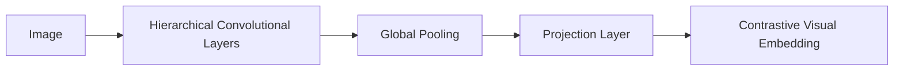

# CNN-Backed CLIP (ResNet Dominant)

## Overview
Employs convolutional neural networks like ResNet to extract hierarchical visual features before projecting them to the cross-modal embedding space.

## Architecture & Workflow
Below is a diagram representing the system flow:

## First Used
- **Year:** 2021
- **Paper:** [Learning Transferable Visual Models From Natural Language Supervision](https://arxiv.org/abs/2103.00020)

[Back to Awesome-CLIP README](../README.md)
