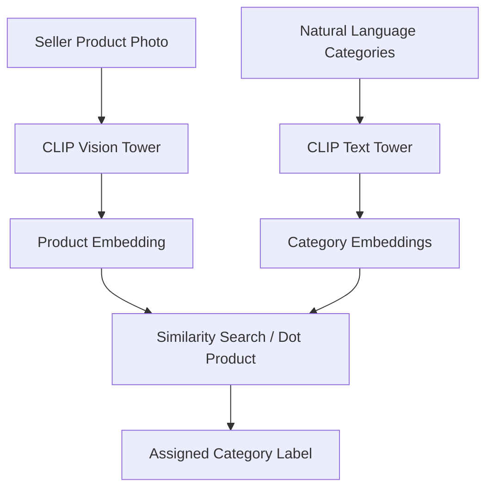

# Open-Vocabulary Zero-Shot E-Commerce Categorization

## Overview
Using CLIP's zero-shot classification capabilities to automatically map marketplace seller product images to arbitrary natural language category strings dynamically.

## Architecture & Workflow
Below is a diagram representing the system flow:

## First Used
- **Year:** 2021
- **Paper:** [Learning Transferable Visual Models From Natural Language Supervision](https://arxiv.org/abs/2103.00020)

[Back to Awesome-CLIP README](../README.md)
