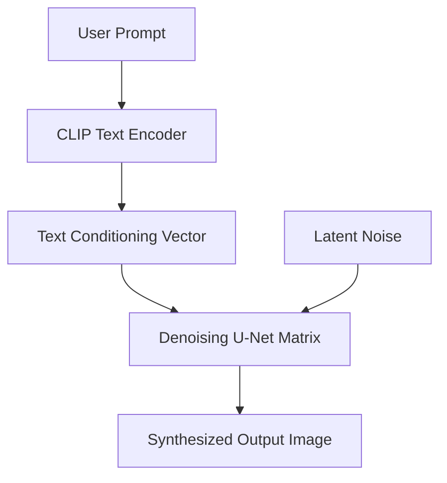

# Text-to-Image Generative Guidance Models (Diffusion Frontends)

## Overview
Utilizing CLIP's text encoder to align generative latent spaces. The text embedding directs the denoising U-Net matrix to synthesize matching graphics.

## Architecture & Workflow
Below is a diagram representing the system flow:

## First Used
- **Year:** 2022
- **Paper:** [High-Resolution Image Synthesis with Latent Diffusion Models](https://arxiv.org/abs/2112.10752)

[Back to Awesome-CLIP README](../README.md)
