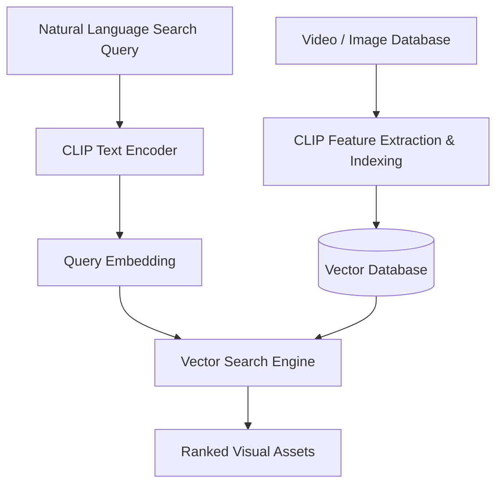

# Enterprise Multi-Modal Semantic Search Engines

## Overview
Indexing corporate video/photo assets in a joint vector space to allow complex natural language query matching and real-time retrieval without manual tagging.

## Architecture & Workflow
Below is a diagram representing the system flow:

## First Used
- **Year:** 2021
- **Paper:** [CLIP4Clip: An Empirical Study of CLIP for Video Text Retrieval](https://arxiv.org/abs/2104.08860)

[Back to Awesome-CLIP README](../README.md)
