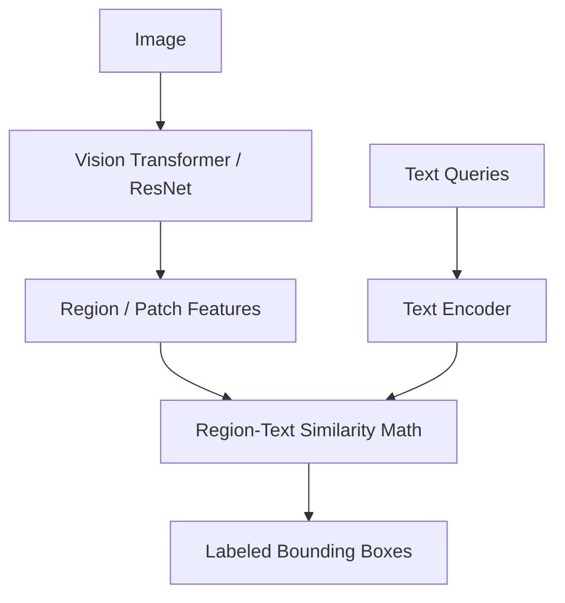

# Dense / Region-Based CLIP (RO-CLIP / OWL-ViT Style)

## Overview
Modifies the image encoder to output dense, region-level visual representations, enabling localized object detection and open-vocabulary spatial grounding.

## Architecture & Workflow
Below is a diagram representing the system flow:

## First Used
- **Year:** 2022
- **Paper:** [Simple Open-Vocabulary Object Detection with Vision Transformers](https://arxiv.org/abs/2205.06230)

[Back to Awesome-CLIP README](../README.md)
