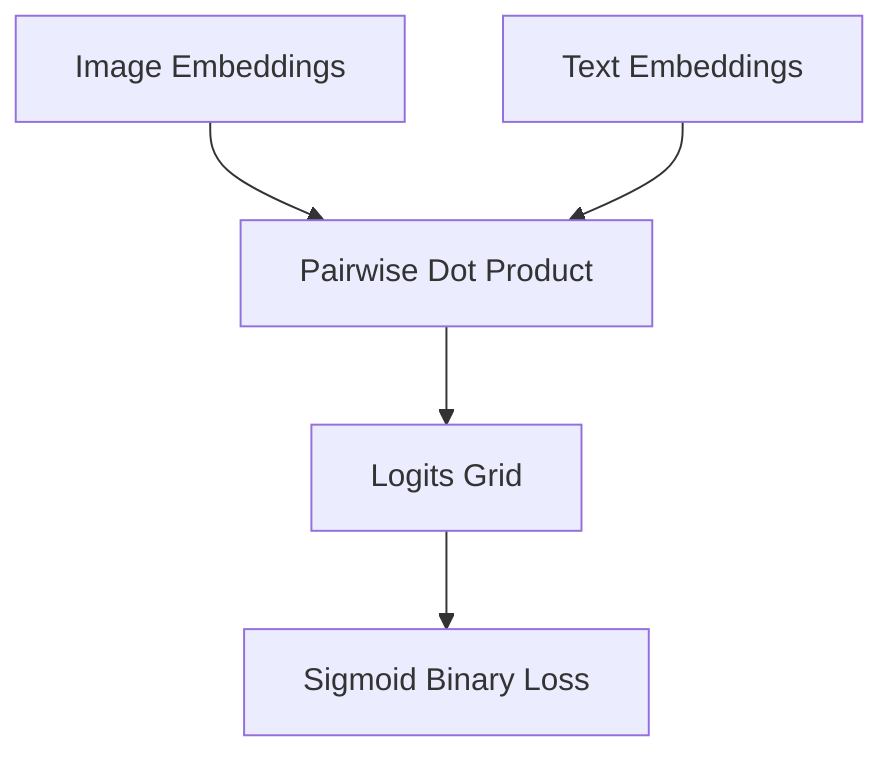

# SigLIP (Sigmoid Pairwise Learning)

## Overview
In contrast to global normalization, SigLIP trains on pairwise binary logistic classification, solving scaling bottleneck and performance issues under limited VRAM.

## Architecture & Workflow
Below is a diagram representing the system flow:

## First Used
- **Year:** 2023
- **Paper:** [Sigmoid Loss for Language-Image Pre-training](https://arxiv.org/abs/2303.15343)

[Back to Awesome-CLIP README](../README.md)
