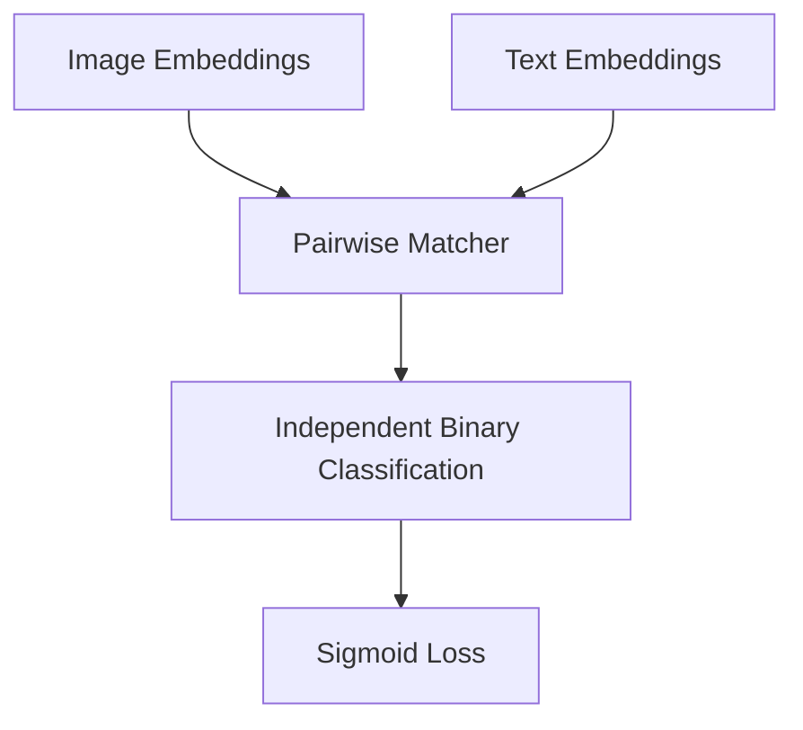

# The Sigmoid Loss & Open Scaling Era (SigLIP, 2023)

## Overview
SigLIP replaces standard InfoNCE loss with a pairwise sigmoid loss. This decouples contrastive scaling from batch size, allowing training with much lower memory requirements and greater efficiency.

## Architecture & Workflow
Below is a diagram representing the system flow:

## First Used
- **Year:** 2023
- **Paper:** [Sigmoid Loss for Language-Image Pre-training](https://arxiv.org/abs/2303.15343)

[Back to Awesome-CLIP README](../README.md)
