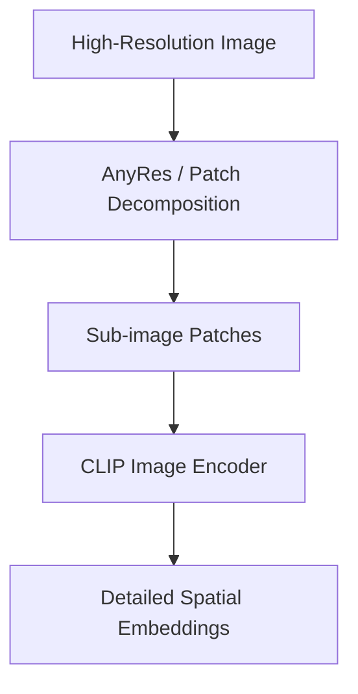

# The Spatial Detail Blurring Limit

## Overview
Standard CLIP models downsample images, losing fine-grained visual/textual details. Mitigated by using high-resolution AnyRes patching or combining with dense spatial models (e.g. SAM).

## Architecture & Workflow
Below is a diagram representing the system flow:

## First Used
- **Year:** 2023
- **Paper:** [Segment Anything](https://arxiv.org/abs/2304.02643)

[Back to Awesome-CLIP README](../README.md)
