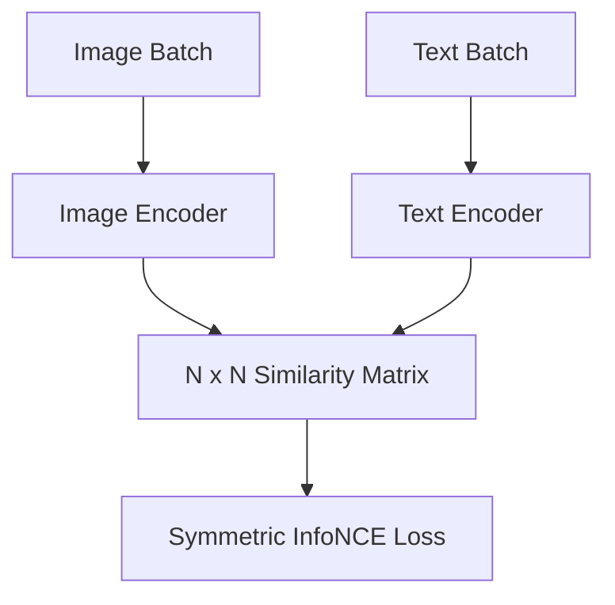

# Standard CLIP (InfoNCE Dual-Tower)

## Overview
Standard CLIP uses a symmetric cross-entropy InfoNCE loss over a global batch similarity matrix to maximize matched image-caption pairs and minimize unmatched pairs.

## Architecture & Workflow
Below is a diagram representing the system flow:

## First Used
- **Year:** 2021
- **Paper:** [Learning Transferable Visual Models From Natural Language Supervision](https://arxiv.org/abs/2103.00020)

[Back to Awesome-CLIP README](../README.md)
