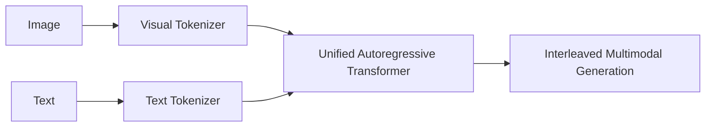

# The Unified Token & Generative Autoregressive Era (~2024–Present)

## Overview
Modern multimodal models integrate visual tokenization directly into the LLM backbone rather than keeping separate text/vision towers, enabling unified interleaved token processing.

## Architecture & Workflow
Below is a diagram representing the system flow:

## First Used
- **Year:** 2024
- **Paper:** [Chameleon: Mixed-Modal Early-Fusion Foundation Models](https://arxiv.org/abs/2405.09818)

[Back to Awesome-CLIP README](../README.md)
